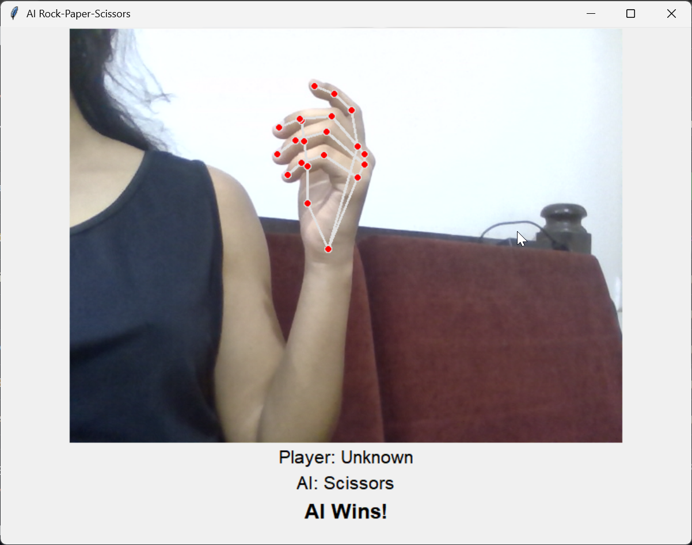
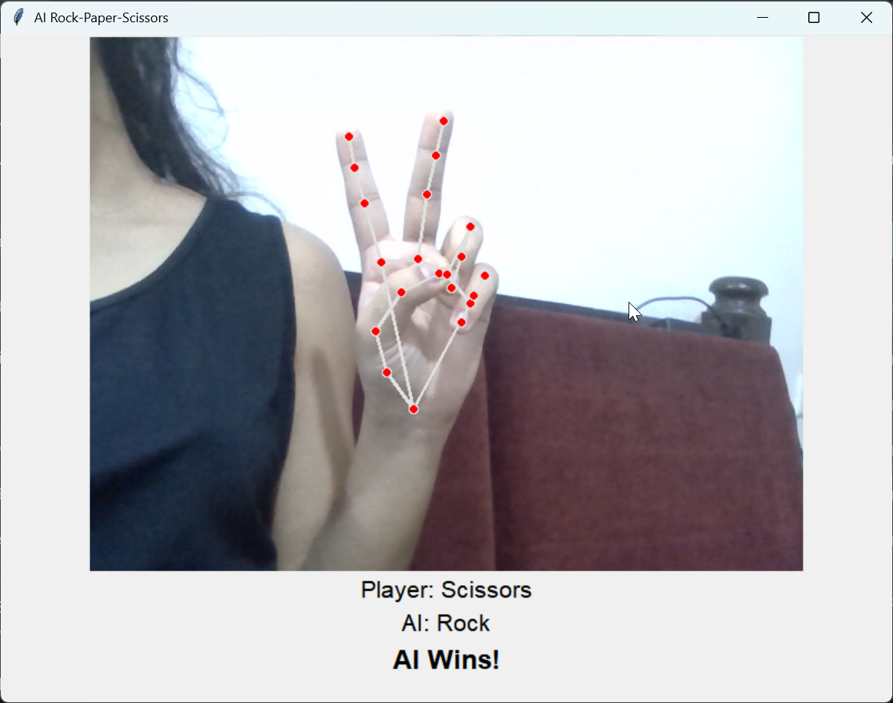

# AI Rock Paper Scissors

An AI-based Rock-Paper-Scissors game using computer vision and hand gesture recognition.

## Features
- Real-time hand gesture detection using OpenCV
- Game against AI using gesture classification
- Tkinter GUI interface

## Screenshots

*Detects invalid move, flagging it as Unknown*
<br/>


## Usage
1. Clone this repository.
2. Create a Python virtual environment and activate it.
3. Install dependencies using:
   ```bash
   pip install -r requirements.txt
